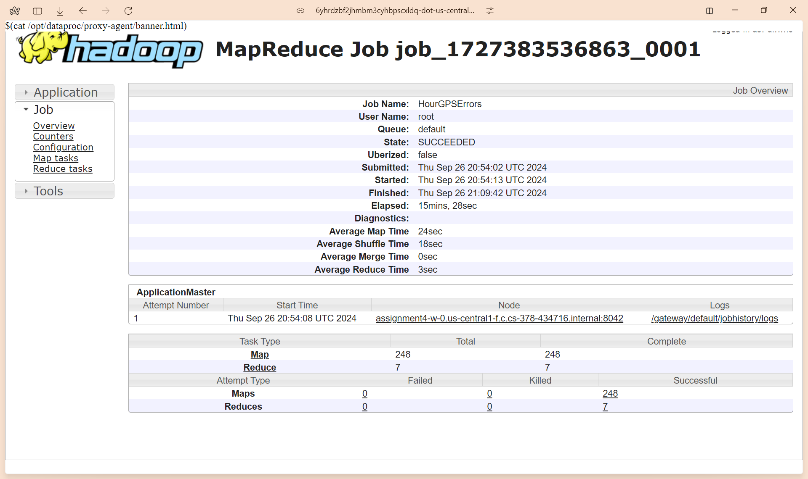

# Assignment 3

## Team members' names

1. Student Name: Caleb Eden

   Student UT EID: cae2672

2. Student Name: Leo Lei

   Student UT EID: ll36476

## Course Name: CS378 - Cloud Computing

## Unique Number: 51515

## Report

### Task 1 - Errors in GPS Position Records By Hour

```txt
1   198227
2   149450
3   113239
4   85404
5   63209
6   50781
7   104844
8   180176
9   219560
10  229790
11  222593
12  228342
13  242220
14  240289
15  250423
16  246748
17  214620
18  244486
19  304402
20  317233
21  296115
22  291004
23  279312
24  247126
```

### Task 2 - Top 5 Taxis by GPS Error Rates

```txt
15D8476E818B8009EAC8018D2D4E8917  1.0
189C1B13B5EF665B1E6F51AB2C5E369F  1.0
1CD95D7378F2999FE588A598A466ABC8  1.0
1ECE9AB1BC7E02671C8526541172399D  1.0
FE757A29F1129533CD6D4A0EC6034106  1.0
```

### Task 3 - Top 10 Drivers by Earnings per Minute

```txt
FD2AE1C5F9F5FBE73A6D6D3D33270571  4095.0
A7C9E60EEE31E4ADC387392D37CD06B8  1260.0
D8E90D724DBD98495C1F41D125ED029A  630.0
E9DA1D289A7E321CC179C51C0C526A73  231.29999
95A921A9908727D4DC03B5D25A4B0F62  210.0
74071A673307CA7459BCF75FBD024E09  210.0
42AB6BEE456B102C1CF8D9D8E71E845A  191.55
FA587EC2731AAB9F2952622E89088D4B  180.0
28EAF0C54680C6998F0F2196F2DA2E21  180.0
E79402C516CEF1A6BB6F526A142597D4  144.54546
```

### Task 4 - Executing on Google Dataproc

#### Cluster


#### Overall Job History


#### Task 1 Job History



#### Task 2 Job History


#### Task 3 Job History


## How to compile the project

We use Apache Maven to compile and run this project.

You need to install Apache Maven (<https://maven.apache.org/>)  on your system.

Type on the command line:

```bash
mvn clean package
```

## How to run Task 1

```bash
java -cp target/MapReduce-TaxiData-0.1-SNAPSHOT-jar-with-dependencies.jar edu.cs.utexas.HadoopEx.HourGPSErrors gs://cs378/taxi-data-sorted-large.csv gs://<bucket>/task1-output
```

## How to run Task 2

```bash
java -cp target/MapReduce-TaxiData-0.1-SNAPSHOT-jar-with-dependencies.jar edu.cs.utexas.HadoopEx.TaxiGPSErrors gs://cs378/taxi-data-sorted-large.csv gs://<bucket>/task2-intermediate gs://<bucket>/task2-output
```

\*Note that our implementation emits top-10 for this since it uses the same code as Task 3. The top 5 can be obtained manually by taking the highest 5 lines of the output.

## How to run Task 3

```bash
java -cp target/MapReduce-TaxiData-0.1-SNAPSHOT-jar-with-dependencies.jar edu.cs.utexas.HadoopEx.DriverEarnings gs://cs378/taxi-data-sorted-large.csv gs://<bucket>/task3-intermediate gs://<bucket>/task3-output
```
